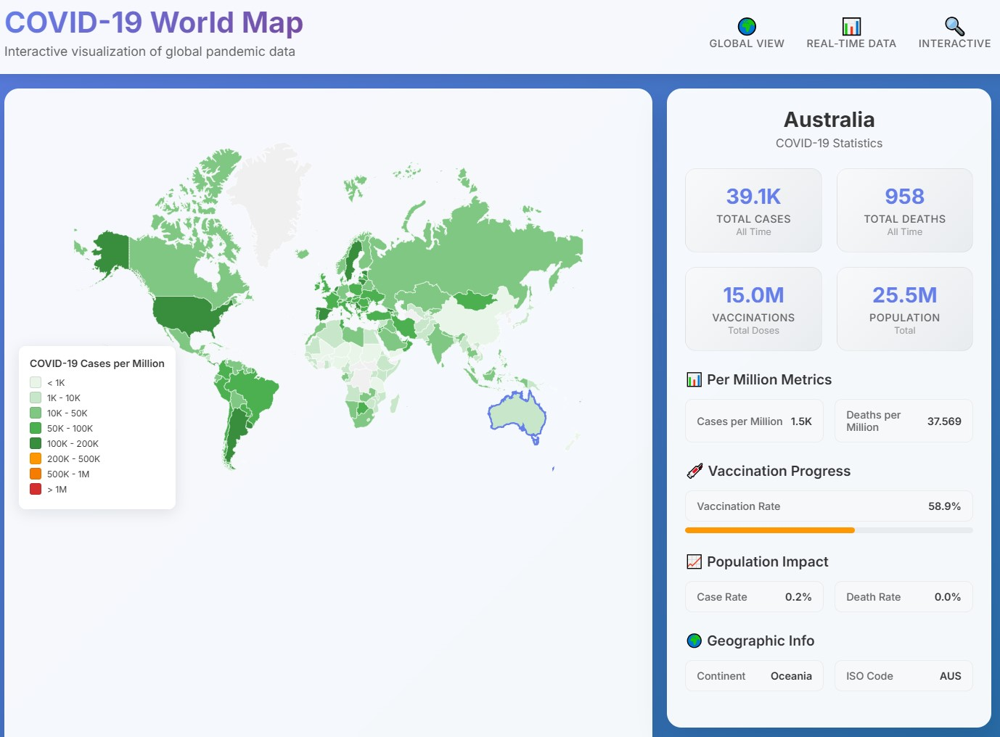

# COVID-19 World Map

An interactive React application that visualizes global COVID-19 data on an interactive world map with modern design and real-time statistics.



## Features

- 🌍 **Interactive World Map**: Click on countries to view detailed COVID-19 statistics
- 📊 **Real-time Data**: Displays current COVID-19 cases, deaths, and vaccination data
- 🎨 **Modern UI**: Beautiful, responsive design with glassmorphism effects
- 📱 **Mobile Responsive**: Optimized for all device sizes
- 🔍 **Detailed Analytics**: Per-million metrics, vaccination progress, and population impact
- 🎯 **Color-coded Visualization**: Countries are colored based on COVID-19 case density

## Technologies Used

- **React 18** with TypeScript
- **Styled Components** for modern styling
- **React Simple Maps** for interactive world map
- **PapaParse** for CSV data parsing
- **Modern CSS** with backdrop filters and gradients

## Getting Started

### Prerequisites

- Node.js (version 14 or higher)
- npm or yarn package manager

### Installation

1. Navigate to the project directory:
   ```bash
   cd covid-world-map
   ```

2. Install dependencies:
   ```bash
   npm install
   ```

3. Start the development server:
   ```bash
   npm start
   ```

4. Open [http://localhost:3000](http://localhost:3000) in your browser

### Building for Production

```bash
npm run build
```

## Data Source

The application uses COVID-19 data from the Our World in Data dataset (`owid-covid-data.csv`). The data includes:

- Total cases and deaths
- New cases and deaths
- Vaccination data
- Testing information
- Population demographics
- Healthcare metrics

## Project Structure

```
src/
├── components/
│   ├── Header.tsx          # Application header with title and stats
│   ├── WorldMap.tsx        # Interactive world map component
│   └── DataPanel.tsx       # Country statistics panel
├── types/
│   └── index.ts            # TypeScript type definitions
├── utils/
│   └── csvParser.ts        # CSV parsing and data processing utilities
├── App.tsx                 # Main application component
└── index.tsx               # Application entry point
```

## Usage

1. **View Global Data**: The map shows all countries with color-coded COVID-19 case density
2. **Select Countries**: Click on any country to view detailed statistics
3. **Analyze Metrics**: View cases per million, death rates, vaccination progress, and more
4. **Interactive Features**: Zoom, pan, and explore the world map

## Color Legend

- 🟢 **Green**: Low case density (< 100K cases per million)
- 🟠 **Orange**: Medium case density (100K - 500K cases per million)
- 🔴 **Red**: High case density (> 500K cases per million)
- ⚪ **Gray**: No data available

## Contributing

1. Fork the repository
2. Create a feature branch
3. Make your changes
4. Test thoroughly
5. Submit a pull request

## License

This project is open source and available under the [MIT License](LICENSE).

## Acknowledgments

- Data provided by [Our World in Data](https://ourworldindata.org/)
- World map data from [React Simple Maps](https://www.react-simple-maps.io/)
- Icons and emojis for enhanced user experience

## Support

If you encounter any issues or have questions, please open an issue in the GitHub repository.

---

**Built with ❤️ using React and modern web technologies**
